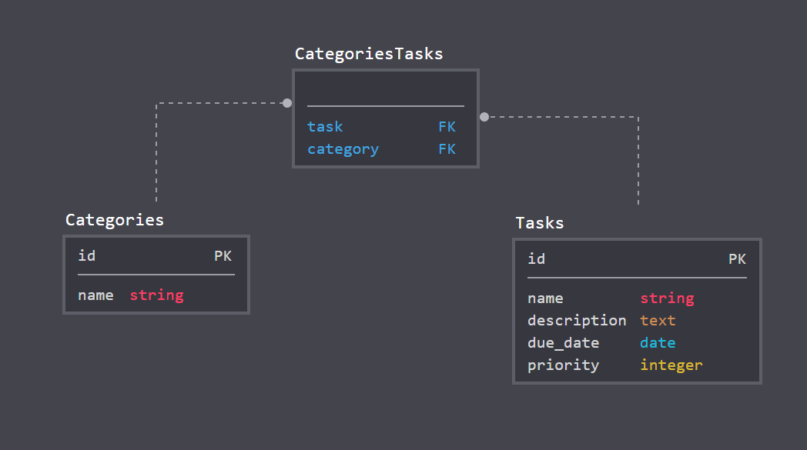

# CVWO Assignment 2017 - MyToDo
  

The code for my 2017 Winter Break Assignment of CVWO (Computing for Voluntary Welfare Organisations).
The app is called **MyToDo**.

Matriculation Number: A0149787E

Name: Julius Putra Tanu Setiaji

## Schema Diagram
`has_many :through` association

## Notes on Permission
I develop on Windows Subsystem for Linux (WSL), so expect some funky permission
(like 777 funky). Fix this using the `rails-fix-permissions` gem
1. `gem install rails-fix-permissions`
2. `rails-fix-permissions`

<!--
This README would normally document whatever steps are necessary to get the
application up and running.

Things you may want to cover:

* Ruby version

* System dependencies

* Configuration

* Database creation

* Database initialization

* How to run the test suite

* Services , e.g. job queues, cache servers, search engines, etc.

* Deployment instructions

* ...)

-->
